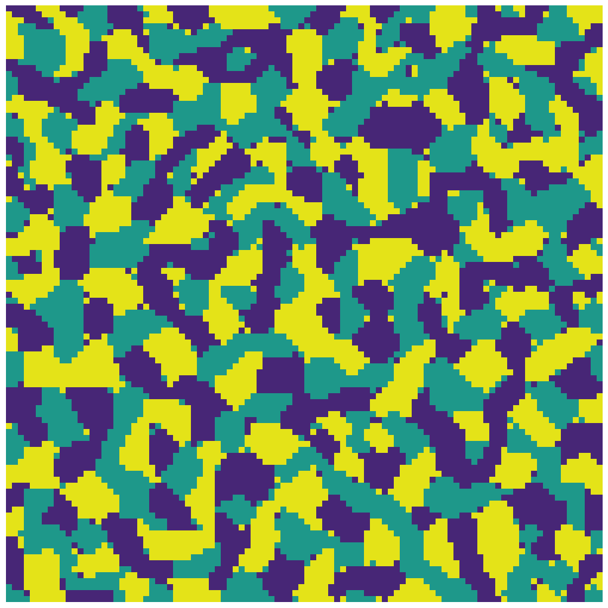

# schelling-segregation
  A model for simulating Schelling's model of ethnic residential segregation and generating gifs or images from the resulting simulation. The model can generate gifs of the whole simulation or just an image of the final result.

## Demo
  ### A schelling simulation with the default settings
  
  
  ### The final image of a three group simulation on a 100x100 grid
  

## Basic
    python schelling.py gif
    python schelling.py image
## Advanced
   To see the full list of current parameters, details and defaults run:
   `python3 schelling.py -h`\
   Example of advanced run:\
   `python3 schelling.py image --groups 3 --size 90 --prejudice 4 --iterations 20 --moves-per-frame 8` 
  
  
